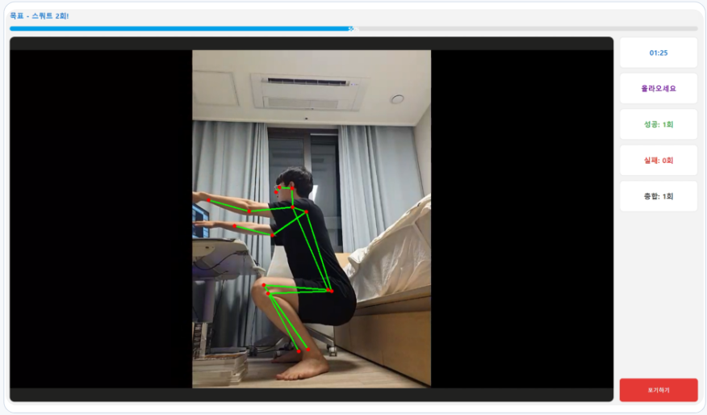

# Workout Pose Checker

YOLO Pose와 PySide6를 이용하여 웹캠 영상에서 사용자의 운동 자세를 실시간으로
분석하는 데스크톱 애플리케이션입니다.



현재 스쿼트와 팔굽혀펴기를 지원하며, 카메라 구도와 관절 위치를 분석하여 운동
상태와 반복 횟수를 화면에 표시합니다. 사용자는 시간 또는 횟수 목표를 설정하고,
운동을 마치면 결과 화면에서 성공·실패 횟수와 운동 시간을 확인할 수 있습니다.

## 주요 기능

- 웹캠을 이용한 실시간 포즈 추론
- 스쿼트 및 팔굽혀펴기 자세 분석
- 카메라 정면·측면 구도 자동 판별
- 운동 성공 및 실패 횟수 집계
- 시간 또는 횟수 기반 목표 설정
- 운동 완료 후 결과 화면 제공
- 실제 모델과 개발용 Mock 서비스 전환 지원

## 시스템 아키텍처

애플리케이션은 화면, 포즈 추론 서비스, 운동별 판정 로직을 분리하여 UI를
변경하거나 운동 종목을 추가할 때 영향을 최소화했습니다.

| 계층 | 주요 구성 | 역할 |
| --- | --- | --- |
| UI | `MainWindow`, `ChoosePage`, `ExercisePage`, `ResultPage` | 운동·목표 선택, 웹캠 표시, 진행 상태와 결과 출력 |
| 서비스 | `PoseService` | YOLO 추론, 분석 대상 선택, 운동별 Analyzer 호출 |
| 분석 | `SquatAnalyzer`, `PushupAnalyzer`, `pose_utils` | 관절 각도 계산, 촬영 방향 판별, 반복 상태와 횟수 관리 |
| 인프라 | OpenCV, YOLO Pose, PySide6 | 영상 입력, 키포인트 추론, 데스크톱 UI 제공 |

`MockPoseService`는 실제 웹캠과 모델 없이 UI 흐름을 확인할 때 사용합니다.

## 처리 파이프라인

```text
웹캠 프레임(OpenCV)
  → YOLO Pose 키포인트 추론
  → 화면에서 가장 크게 감지된 사람 선택
  → 운동별 필수 관절과 촬영 방향 확인
  → 관절 각도 및 반복 상태 분석
  → 성공·실패 횟수와 안내 상태 생성
  → PySide6 화면 갱신 및 목표 달성 시 결과 화면 이동
```

분석 전에는 원본 프레임을 사용하고, 사용자에게 보여주는 영상만 좌우 반전합니다.
Analyzer는 한 프레임의 자세만 보지 않고 `READY → GO_DOWN → GO_UP → SUCCESS`
상태 전환과 연속 프레임 확인을 이용해 반복 횟수를 계산합니다.

## 개발 환경

- Python 3.10.20
- Ultralytics 8.4.109
- PyTorch 2.13.0 (현재 개발 PC는 CPU 전용 빌드)
- OpenCV 5.0.0.93
- PySide6 6.11.1
- Conda 환경 이름: `yolo_pose`

`environment.yml`은 새 개발 환경을 만들기 위한 팀 기준 파일입니다.
`requirements-lock.txt`는 2026-07-29에 설치되어 있던 전체 패키지의
스냅샷이며, 가상환경 폴더 자체는 저장소에서 공유하지 않습니다.

## 설치

Anaconda Prompt에서 프로젝트 폴더로 이동한 후 다음 명령을 실행합니다.

```powershell
conda env create -f environment.yml
conda activate yolo_pose
python --version
```

기존 환경을 팀 기준 파일에 맞춰 갱신하려면 다음 명령을 사용합니다.

```powershell
conda env update -n yolo_pose -f environment.yml --prune
```

GPU를 사용하는 PC에서는 위 환경을 만든 다음 해당 PC의 NVIDIA 드라이버에 맞는
PyTorch 빌드로 교체해야 합니다. CUDA 구성은 컴퓨터마다 다를 수 있으므로
`environment.yml`에 고정하지 않습니다.

## 모델 준비

YOLO Pose 모델 파일을 다음 위치에 배치합니다.

```text
models/yolo26n-pose.pt
```

모델 가중치와 데이터셋, `runs/` 실행 결과는 Git 저장소에 포함하지 않습니다.
팀원 간에는 공유 드라이브나 릴리스 자산 등의 별도 저장소를 이용해야 합니다.

## 실행

프로젝트 루트에서 다음 명령을 실행하면 PySide6 UI가 열립니다.

```powershell
python src/workout_pose_checker/main_window.py
```

### Windows 실행 파일 빌드

`yolo_pose` Conda 환경을 활성화한 뒤 프로젝트 루트에서 빌드 스크립트를
실행합니다.

```powershell
conda activate yolo_pose
powershell -ExecutionPolicy Bypass -File scripts/build_windows.ps1
```

빌드가 끝나면 `dist/WorkoutPoseChecker/` 폴더가 생성됩니다. 이 폴더에는 실행
파일과 필요한 라이브러리, `models/yolo26n-pose.pt`가 함께 배치됩니다.

```text
dist/WorkoutPoseChecker/
  WorkoutPoseChecker.exe
  models/yolo26n-pose.pt
  _internal/
```

실행 파일만 따로 옮기지 말고 `WorkoutPoseChecker` 폴더 전체를 배포해야 합니다.

현재 기본 설정은 실제 `PoseService`를 사용합니다. 모델 없이 UI 흐름만 테스트하려면
`src/workout_pose_checker/main_window.py`의 다음 스위치를 변경합니다.

```python
USE_MOCK_POSE_SERVICE = True
```

실제 YOLO 모델이 인식한 관절점과 연결선을 운동 화면에 표시하려면 같은 파일의
다음 스위치를 활성화합니다. `False`로 설정해도 자세 분석은 계속 실행되며 화면의
관절 표시만 숨겨집니다.

```python
SHOW_POSE_LANDMARKS = True
```

별도의 OpenCV 창에서 포즈 분석 기능만 확인하려면 운동 종류를 지정하여 실행합니다.

```powershell
python -m src.workout_pose_checker.webcam_pose --exercise squat
python -m src.workout_pose_checker.webcam_pose --exercise pushup
```

## 사용 방법

1. 스쿼트 또는 팔굽혀펴기를 선택합니다.
2. 시간 또는 횟수 모드를 선택합니다.
3. 목표 시간을 분 단위로, 또는 목표 반복 횟수를 설정합니다.
4. `운동 시작 하기` 버튼을 누릅니다.
5. 주요 관절과 몸 전체가 카메라 화면에 보이도록 위치를 조정합니다.
6. 목표에 도달하면 결과 화면에서 성공·실패 횟수와 운동 시간을 확인합니다.

운동 화면에서 `포기하기` 버튼을 누르거나 창을 닫으면 웹캠 장치가 해제됩니다.
카메라 구도는 정면과 측면 중 하나로 자동 판별되며, 판별된 구도에 맞는 분석
기준이 적용됩니다.

## 테스트

프로젝트 루트에서 다음 명령을 실행합니다.

```powershell
python -m pytest -q
```

현재 `PoseService`와 스쿼트·팔굽혀펴기 분석기의 단위 테스트를 제공합니다.

## 프로젝트 구조

```text
data/                       로컬 데이터셋 (Git 제외)
models/                     모델 가중치 (Git 제외)
runs/                       Ultralytics 실행 결과 (Git 제외)
발표자료/                   프로젝트 발표용 PowerPoint 자료
src/workout_pose_checker/
  analyzers/                운동별 자세 판정 로직
  images/                   운동 선택 화면 이미지
  pages/                    선택·운동·결과 UI 페이지
  main_window.py            애플리케이션 진입점
  pose_service.py           UI와 분석기를 연결하는 포즈 서비스
  mock_pose_service.py      UI 개발용 Mock 서비스
tests/                      단위 테스트
docs/                       개발 문서
environment.yml             팀 Conda 환경 기준
requirements-lock.txt       설치 패키지 스냅샷
```

## 알려진 제약 사항

- 기본 카메라 장치인 인덱스 `0`을 사용합니다.
- 모델 가중치는 별도로 준비해야 합니다.
- 몸의 주요 관절이 화면 밖으로 벗어나면 자세를 안정적으로 판정하기 어렵습니다.
- 카메라 구도, 조명, 배경과의 대비에 따라 판정 정확도가 달라질 수 있습니다.
- CPU 환경에서는 실시간 처리 속도가 낮을 수 있습니다.

## 트러블슈팅 요약

### UI와 포즈 분석 로직의 강한 결합

초기에는 운동 화면에서 모델 추론과 자세 판정 로직을 함께 처리하여 UI 수정과
분석기 테스트가 어려웠습니다. `PoseService`를 UI와 분석기 사이의 공통 연동
지점으로 두고, 스쿼트와 팔굽혀펴기 판정 로직을 각각의 Analyzer 클래스로
분리했습니다. UI 개발 시에는 동일한 인터페이스를 제공하는
`MockPoseService`를 사용할 수 있도록 구성했습니다.

### 정면과 측면 자세 판정 충돌

카메라 구도에 따라 필요한 관절과 판정 기준이 달라 하나의 기준만으로는 안정적인
분석이 어려웠습니다. 어깨 너비와 몸통 길이의 비율로 정면과 측면을 구분하고,
현재 구도에 따라 별도의 판정 기준을 적용했습니다. 경계값 부근에서 구도가 계속
전환되는 현상을 줄이기 위해 진입·이탈 임계값도 분리했습니다.

### 여러 사람이 화면에 잡히는 문제

웹캠에 여러 사람이 나타나면 분석 대상이 프레임마다 바뀌어 운동 상태와 반복
횟수가 불안정해질 수 있었습니다. 감지된 사람 중 화면에서 가장 크게 잡힌 한 명을
분석 대상으로 선택하여 추적 대상을 안정화했습니다.

### 페이지 이동 후 카메라가 계속 사용되는 문제

운동 종료 또는 화면 이동 이후에도 카메라 객체와 타이머가 남으면 카메라를 다시
열지 못할 수 있습니다. 운동 포기, 정상 종료, 창 닫기 경로에서 공통으로 카메라
타이머를 중지하고 `release()`를 호출하도록 정리했습니다.

### 운동 횟수가 중복 집계되는 문제

같은 자세를 유지하는 동안 매 프레임을 성공으로 처리하면 반복 횟수가 여러 번
증가할 수 있습니다. 운동 상태를 단계별로 관리하고, 준비 자세에서 완료 자세로
정상적으로 전환된 경우에만 횟수를 증가시키도록 변경했습니다.

## 개발 문서

- [포즈 평가 코드 가이드](docs/pose_evaluation_guide.md): 파일별 역할, 처리 흐름,
  상태 판정 방식과 기능 확장 방법
- [모델·UI 연동 규칙](docs/model_ui_contract.md): UI 호출 방법과 반환 데이터 계약
- [추가 트러블슈팅 기록](troubleshoot.md): 개발 중 확인한 문제와 후속 개선 사항
- [Windows 실행 파일 빌드 가이드](docs/windows_build_guide.md): 빌드, 실행,
  배포 및 오류 해결 방법

## 브랜치 운영

- `main`: 검증이 완료된 배포 기준 브랜치
- `integration`: 여러 기능을 통합하고 테스트하는 브랜치
- `feature/<작업>`: 기능 개발 브랜치
- `fix/<작업>`: 버그 수정 브랜치

기능 브랜치를 `integration`에 먼저 병합하고 통합 테스트를 수행한 후, 검증된
변경 사항을 `main`에 병합합니다. `main`에는 직접 작업하지 않는 것을 원칙으로
합니다.
